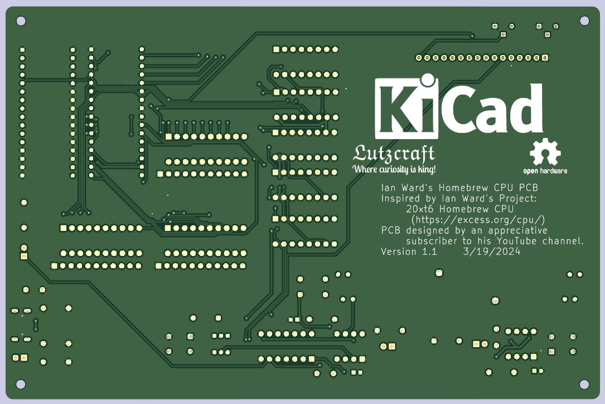

# Homebrew CPU Project PCB

My inspiration for this PCB came from following Ian Ward's project on his web site:

[20xt6 Homebrew CPU Project](https://excess.org/cpu/)

This PCB implements the [LCD Character Display: Milestone 1 Complete!](https://www.youtube.com/watch?v=neW9uogt1gw) stage of this series of videos. 

But there is more to come in the future, so checkout Ian's videos on his future plans:

[Discrete Logic Rhythm Game Prototype (no CPU)](https://www.youtube.com/watch?v=yo5xX4GLc_U)

[Designing a Rhythm Game: Homebrew CPU Plan Step 2](https://www.youtube.com/watch?v=taPa7SQpib4)

[Maze Game Prototype (no CPU!)](https://www.youtube.com/shorts/fGyHHWiAYDM)

I will try to keep up with him.

PCB Front Image

PCB Back Image

# Homebrew CPU PCB BOM

## Wed, Mar 21, 2024, 08:58:15

## Component Count: 25

Ref | Qty | Value | Vendor\Part # | Description
----|-----|-------|---------------|-----------
C1, C3, C5 | 3 | 10uF | Generic | Electrolytic capacitor
C2, C4, C6 | 2 | .01uF | Digikey\FG28C0G1H103JNT06 | Unpolarized capacitor 
D1 | 1 | YELLOW\Reset | Generic | LED\3mm\Yellow
D2 | 1 | RED\HALT | Generic | LED\3mm\Red 
D3 | 1 | BLUE\CLOCK | Generic | LED\3mm\Blue
D4, D5 | 2 | 10_SEG_LED BAR_GRAPH (Blue) | Digikey\1497-1079-5-ND | LED Bar Graph\Blue\1x10 
D6 | 1 | 10_SEG_LED  BAR_GRAPH (Yellow) | Digikey\754-1179-5-ND | LED Bar Graph\Yellow\1x10 
D7 | 1 | GREEN | Generic | LED\3mm\Green 
J1 | 1 | PinSocket_1x16_P2.54mm_Vertical | Generic | Female Pin Header\1x16\2.54mm pitch
J2 | 1 | UJC-HP-M-G-5-MSMT-TR | Digikey\2223-UJC-HP-M-G-5-MSMT-TRDKR-ND | Type C/20 VDC/3A/Horizontal/6 Pin/Power Only
R1, R3, R8 | 3 | 1Kohm | Digikey\13-MFR-25FTE52-1KCT-ND | Resistor\1Kohm\1%\1/4W\Axial
R2, R6, R7, R9 | 4 | 330ohm | Digikey\13-MFR-25FRF52-330RCT-ND | Resistor\330ohm\1%\1/4W\Axial
R4 | 1 | 220ohm | Generic | Resistor\220ohm\1%\1/4W\Axial
R5 | 1 | 3ohm | Generic | Resistor\3ohm\1%\1/4W\Axial
R10, R11 | 2 | 5.1Kohm | Digikey\13-MFR-25FTE52-5K1CT-ND | Resistor\5K1ohm\1%\1/4W\Axial
RN1, RN2, RN3 | 3 | 470ohm | Digikey\4609X-101-471LF-ND | Resistor Array\8 Resistors\470ohm\9SIP
RV1 | 1 | 10Kohm | Jameco\2276439 | Panasonic EWAQ30C15A14 Audio Slide Pot
RV2, RV3 | 2 | 5Kohm | Digikey\3386P-1-502LF | Trimmer Pot\5Kohms\0.5W\1/2W\Through Hole
SW1 | 1 | TL2230 | Digikey\EG6031-ND | Switch\Pushbutton\DPDT\Through Hole
S1 | 1 | REG SELECT | Digikey\450-1654-ND | Switch\Tactile\SPST-NO\0.05A\24V\Through Hole
S2 | 1 | ENABLE | Digikey\450-1654-ND | Switch\Tactile\SPST-NO\0.05A\24V\Through Hole
U1, U3 | 2 | LM555 | Digikey\LM555CNNS/NOPB-ND | 555 Timer/Oscillator\100kHz\8-PDIP
U2 | 1 | 74LS00 | Digikey\296-1626-ND | NAND Gate IC 4 Channel 14-PDIP
U4, U5, U6, U7, U8 | 5 | 74LS163 | Digikey\296-3661-5-ND | Binary Counter\4 Bit\Positive Edge\16-PDIP
U9, U10 | 2 | SST39SF040-70-4C-PHE | Digikey\SST39SF040-70-4C-PHE-ND | FLASH Memory\4Mbit\70ns\32-PDIP

The LCD and its 16-pin male header are represented only with 3D models, but you need a 2004 LCD with a soldered 16-pin male header with a pitch of 2.54mm to plug into the 16 pin female header to complete this PCB. I have found the best place to get these is on eBay.
 Do NOT try to use a 2004 LCD with an I2C adapter on it.

Most symbols/footprints/models are contained under the 'libraries' directory. Capacitors, resistors and LEDs use KiCad symbols/footprints/models.

Models will display an appropriate socket under the ICs but these can be omitted on the PCB - they are used to make it easier to replace any components should they need it in the future. The only exceptions are the sockets for the SST39SF040 FLASH chips. These chips can be changed out for different program\lookup combinations, so you do not want to solder them to the PCB. I would recommend using 32-pin sockets from Aries Electronics or something equivalent, for example, Digikey\A410AE-ND.